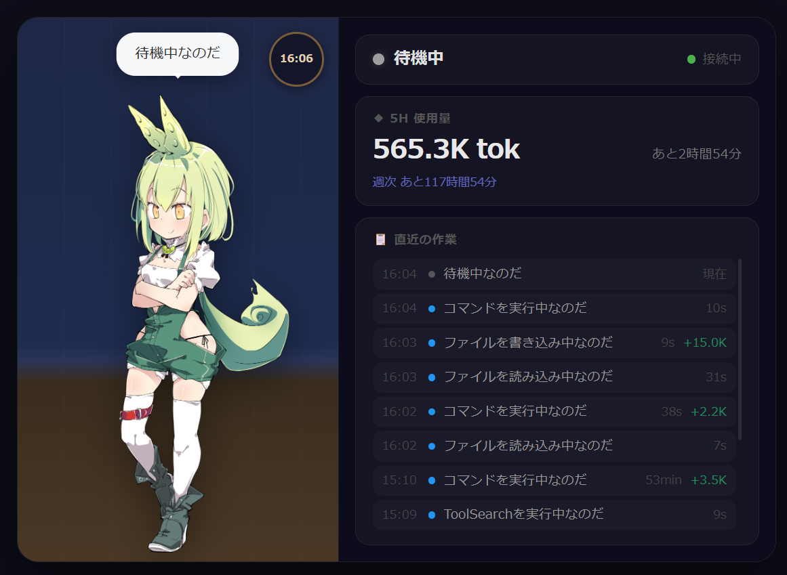

# 🎋 ずんだもんコンパニオン for Claude Code

Claude Code と一緒に作業するずんだもんのビジュアルコンパニオンなのだ！

リアルタイムで作業状況を表示し、VOICEVOX で音声通知もしてくれるのだ。



---

## ✨ 機能

- 🟢 **リアルタイムステータス表示** — Claude Code の作業状況（作業中・完了・エラー・休憩）を SSE でブラウザに即時反映
- 🎭 **ステータス別キャラクター切替** — 状態に応じてずんだもんのポーズが自動で変わる（idle / working / complete / error）
- 🔊 **VOICEVOX 音声通知** — ずんだもんの声で作業開始・完了・エラーを通知
- 📊 **トークン使用量モニター** — Claude の 5h 制限・週間制限の残量をリアルタイム表示
- 📋 **作業履歴ログ** — ステータス変化のタイムライン＋各タスクごとのトークン消費量を表示
- 🔔 **許可通知** — Claude Code が許可を求める時だけ音声で知らせる

---

## 📸 UI 説明

| 項目 | 説明 |
|---|---|
| 左パネル | ずんだもんキャラクター（ステータスで表情・ポーズが変化） |
| ステータス欄 | 現在の作業状態とサーバー接続状況 |
| 5H 使用量 | 現在の 5 時間ウィンドウのトークン使用量と残り時間 |
| 直近の作業 | 作業ログ・かかった時間・消費トークン数 |

---

## 📋 前提条件

- [Node.js](https://nodejs.org/) 18 以上
- [Claude Code](https://claude.ai/claude-code) インストール済み
- [VOICEVOX](https://voicevox.hiroshiba.jp/) インストール済み（音声通知を使う場合）

---

## 🚀 インストール

### 1. クローン & npm install

```bash
git clone https://github.com/MinineAI/zundamon-companion.git
cd zundamon-companion
npm install
```

### 2. Claude Code 設定を自動セットアップ

```bash
node setup.js
```

このスクリプトが以下を自動で行います:
- `~/.claude/settings.json` に MCP サーバーとフックを追加
- `~/.claude/scripts/` にフックスクリプトをコピー
- `~/.claude/CLAUDE.md` にずんだもんの動作ルールを追記

### 3. Claude Code を再起動

設定を反映させるために Claude Code を再起動してください。

### 4. 起動

```bash
# Windows
start.bat をダブルクリック（ブラウザが自動で開きます）

# または手動
node server/index.js
```

ブラウザで **http://localhost:3456** を開きます。

---

## 🏗️ アーキテクチャ

```
Claude Code
    │
    ├── MCP Server (--mcp モード)
    │       └── update_status ツール
    │               │
    │               ▼
    │       HTTP POST /api/update
    │               │
    ├── Hooks (PreToolUse / Stop / PermissionRequest)
    │       └── status-update.js / permission-notify.js
    │
    ▼
HTTP Server (localhost:3456)
    │
    ├── GET  /api/status    — 現在のステータス取得
    ├── POST /api/update    — ステータス更新
    ├── GET  /api/usage     — トークン使用量（JSONLログから集計）
    └── GET  /events        — Server-Sent Events（ブラウザへプッシュ）
            │
            ▼
        ブラウザ UI (index.html)
            └── ずんだもんキャラクター + リアルタイムステータス
```

---

## 📁 ファイル構成

```
zundamon-companion/
├── server/
│   ├── index.js         — エントリーポイント（HTTP/MCPモード切替）
│   ├── http-server.js   — Express HTTPサーバー
│   ├── mcp-server.js    — MCP サーバー（Claude Code連携）
│   ├── state.js         — 共有ステート + SSEブロードキャスト
│   └── usage.js         — トークン使用量計算（JSONLログ解析）
├── public/
│   ├── index.html            — メインUI
│   ├── style.css             — スタイル
│   ├── app.js                — フロントエンドロジック
│   ├── zundamon.png          — idle ポーズ
│   ├── zundamon-working.png  — working ポーズ
│   ├── zundamon-complete.png — complete ポーズ
│   └── zundamon-error.png    — error ポーズ
├── claude-config/
│   ├── CLAUDE-zundamon.md    — CLAUDE.md に追記されるルール
│   ├── settings-template.json — settings.json のテンプレート
│   └── scripts/
│       ├── status-update.js     — PreToolUse/Stop フックスクリプト
│       ├── permission-notify.js — PermissionRequest フックスクリプト
│       └── voicevox-notify.ps1  — VOICEVOX 音声再生（PowerShell）
├── docs/
│   └── screenshot.png   — UI スクリーンショット
├── setup.js     — 新PC用セットアップスクリプト
├── start.bat    — 起動バッチ（ブラウザ自動起動）
└── package.json
```

---

## 🔧 ステータス一覧

| ステータス | 表示 | キャラクター | 用途 |
|---|---|---|---|
| `idle` | 待機中 | 腕組みポーズ | Claude が待機中 |
| `working` | 作業中 | 腰当てポーズ | ツール実行中 |
| `complete` | 完了 | 両手腰当てポーズ | タスク完了 |
| `error` | エラー | 困り顔ポーズ | エラー発生 |
| `break` | 休憩中 | 両手腰当てポーズ | 休憩中 |

---

## 📄 ライセンス

MIT License
